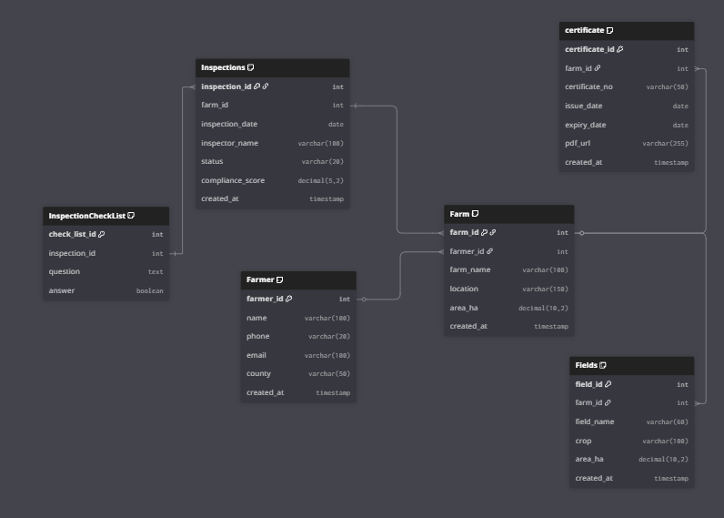

# Organic Certification Local Database Setup

Organic Certification backend uses PostgreSQL as its local database to store Farm, Farmer, Fields, Inspection, Certificate and related data. This document outlines the database configuration and setup process for local development.

## Database Overview
- **User**: `configure own on the .env file`
- **Password**: `configure own on the .env file`
- **Port**: `5432`
- **Driver**: PostgreSQL JDBC (`"jdbc:postgresql://postgres-db:5432/${POSTGRES_DB}`)

## Tables and UML Diagram
 

## Docker Setup
Use the `compose.yml` file to run PostgreSQL locally:
- Ensure `.env` is configured with `POSTGRES_DB`, `POSTGRES_USER`, and `POSTGRES_PASSWORD`.
- Run: `docker-compose up --build`
- Check logs: `docker logs name of container`

## Swagger - Docs
This project integrates Swagger UI via   `springdoc-openapi`. swagger provides an interactive interface to explore and test APIs
## Available Endpoints
After starting the Springboot application, Swagger is accessible at:
- Swagger UI (interactive docs)
    - http://localhost:8081/swagger-ui.html
    - http://localhost:8081/swagger-ui/index.html
    - https://organic-certification-production.up.railway.app/swagger-ui/index.html
- Both resolve to the same UI
- OpenAPI JSON spec
    - http://localhost:8081/apidocs
    - https://organic-certification-production.up.railway.app/v3/api-docs
## Use this command to access your db in docker
docker exec -it postgres-organic psql -U *your .env config user* -d *your .env config database*

